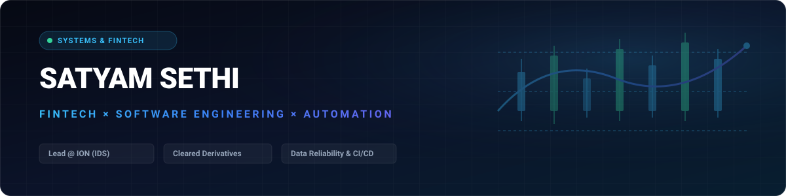

 

### *“I build systems where bad data isn't an option.”*

 &nbsp;  &nbsp; 

 

`Software / Quality Engineering Lead @ ION` &nbsp;·&nbsp; `Financial Data` &nbsp;·&nbsp; `Cleared Derivatives`

 

 Validation -> Reconciliation -> Settlement -> Observability" width="100%" />

---

### What I Build

* 💸 **Financial Systems** — Multi-way reconciliation engines, ISO compliance validators, and multi-rail settlement state machines.
* ⚙️ **Engineering** — In-memory reverse proxies, concurrency tools, REST APIs, and automated test frameworks.
* 🚀 **Infrastructure** — CI/CD delivery pipelines, Docker containerization, AWS cloud, and high-concurrency probing.

---

### 🚀 Selected Builds

<table>
  <tr>
    <td width="50%" valign="top">
      
<strong><code>FINTECH</code></strong>

      <h4><a href="https://recon.satyamsethi.dpdns.org">transaction-reconciliation-engine</a></h4>
      
Multi-way ledger reconciliation matching internal transactions against bank statements with automated break resolution.

      <code>Node.js</code> <code>Reconciliation</code> <code>Vanilla JS</code>
        
      <a href="https://recon.satyamsethi.dpdns.org"><strong>Live Demo ↗</strong></a> &nbsp;·&nbsp; <a href="https://github.com/Satyam-h-Sethi/transaction-reconciliation-engine">Source →</a>
    </td>
    <td width="50%" valign="top">
      
<strong><code>FINTECH</code></strong>

      <h4><a href="https://quality.satyamsethi.dpdns.org">financial-data-quality-validator</a></h4>
      
Rule-based compliance validator enforcing ISO 6166 ISIN checksums, ISO 4217 currencies, LEIs, and trade integrity rules.

      <code>JavaScript</code> <code>ISO Standards</code> <code>Compliance</code>
        
      <a href="https://quality.satyamsethi.dpdns.org"><strong>Live Demo ↗</strong></a> &nbsp;·&nbsp; <a href="https://github.com/Satyam-h-Sethi/financial-data-quality-validator">Source →</a>
    </td>
  </tr>
  <tr>
    <td width="50%" valign="top">
      
<strong><code>FINTECH</code></strong>

      <h4><a href="https://settlement.satyamsethi.dpdns.org">settlement-monitor</a></h4>
      
Multi-rail clearing operations monitor (Fedwire, SWIFT, SEPA, ACH, RTGS) tracking settlement cycles, latency, and exceptions.

      <code>Node.js</code> <code>State Machine</code> <code>Clearing</code>
        
      <a href="https://settlement.satyamsethi.dpdns.org"><strong>Live Demo ↗</strong></a> &nbsp;·&nbsp; <a href="https://github.com/Satyam-h-Sethi/settlement-monitor">Source →</a>
    </td>
    <td width="50%" valign="top">
      
<strong><code>ENGINEERING</code></strong>

      <h4><a href="https://cache.satyamsethi.dpdns.org">http-cache-proxy</a></h4>
      
In-memory caching reverse proxy with TTL eviction, <code>X-Cache</code> telemetry headers, and real-time traffic analytics.

      <code>Node.js</code> <code>HTTP</code> <code>Caching Layer</code>
        
      <a href="https://cache.satyamsethi.dpdns.org"><strong>Live Demo ↗</strong></a> &nbsp;·&nbsp; <a href="https://github.com/Satyam-h-Sethi/http-cache-proxy">Source →</a>
    </td>
  </tr>
  <tr>
    <td width="50%" valign="top">
      
<strong><code>INFRASTRUCTURE</code></strong>

      <h4><a href="https://urlcheck.satyamsethi.dpdns.org">url-health-monitor</a></h4>
      
High-concurrency endpoint health and latency monitor with live visual metrics, CSV/JSON exports, and automated alerts.

      <code>Node.js</code> <code>Concurrency</code> <code>Monitoring</code>
        
      <a href="https://urlcheck.satyamsethi.dpdns.org"><strong>Live Demo ↗</strong></a> &nbsp;·&nbsp; <a href="https://github.com/Satyam-h-Sethi/url-health-monitor">Source →</a>
    </td>
    <td width="50%" valign="top">
      
<strong><code>DEVOPS & EDUCATION</code></strong>

      <h4><a href="https://linux.satyamsethi.dpdns.org">linux-interview-notes-web</a></h4>
      
Interactive Linux &amp; DevOps revision command center with hierarchical notes, oral Q&amp;A drills, flashcards, and incident playbooks.

      <code>Vanilla JS</code> <code>DevOps</code> <code>Linux</code>
        
      <a href="https://linux.satyamsethi.dpdns.org"><strong>Live Demo ↗</strong></a> &nbsp;·&nbsp; <a href="https://github.com/Satyam-h-Sethi/linux-interview-notes-web">Source →</a>
    </td>
  </tr>
  <tr>
    <td width="50%" valign="top">
      
<strong><code>ENGINEERING</code></strong>

      <h4><a href="https://schema.satyamsethi.dpdns.org">json-schema-visualizer</a></h4>
      
Interactive JSON hierarchy inspector generating TypeScript interfaces and Draft-07 schemas from arbitrary payloads.

      <code>JavaScript</code> <code>TypeScript</code> <code>JSON Schema</code>
        
      <a href="https://schema.satyamsethi.dpdns.org"><strong>Live Demo ↗</strong></a> &nbsp;·&nbsp; <a href="https://github.com/Satyam-h-Sethi/json-schema-visualizer">Source →</a>
    </td>
    <td width="50%" valign="top">
      
<strong><code>DEVELOPER TOOLS</code></strong>

      <h4><a href="https://regex.satyamsethi.dpdns.org">regex-debugger-visualizer</a></h4>
      
Interactive regex engine highlighting matches and capture groups in real time with token breakdowns and presets.

      <code>JavaScript</code> <code>RegEx</code> <code>Web Tool</code>
        
      <a href="https://regex.satyamsethi.dpdns.org"><strong>Live Demo ↗</strong></a> &nbsp;·&nbsp; <a href="https://github.com/Satyam-h-Sethi/regex-debugger-visualizer">Source →</a>
    </td>
  </tr>
  <tr>
    <td width="50%" valign="top">
      
<strong><code>DEVELOPER TOOLS</code></strong>

      <h4><a href="https://ascii.satyamsethi.dpdns.org">ascii-diagram-generator</a></h4>
      
Interactive ASCII architecture studio and DSL compiler generating flowcharts, sequence diagrams, and boxes.

      <code>JavaScript</code> <code>ASCII Art</code> <code>CLI & Web</code>
        
      <a href="https://ascii.satyamsethi.dpdns.org"><strong>Live Demo ↗</strong></a> &nbsp;·&nbsp; <a href="https://github.com/Satyam-h-Sethi/ascii-diagram-generator">Source →</a>
    </td>
    <td width="50%" valign="top">
      
<strong><code>DEVELOPER TOOLS</code></strong>

      <h4><a href="https://markdown.satyamsethi.dpdns.org">markdown-to-html-cli</a></h4>
      
Fast zero-dependency Markdown parser and live Web Studio with light/dark styling and instant HTML export.

      <code>Node.js</code> <code>Markdown</code> <code>CLI & Web</code>
        
      <a href="https://markdown.satyamsethi.dpdns.org"><strong>Live Demo ↗</strong></a> &nbsp;·&nbsp; <a href="https://github.com/Satyam-h-Sethi/markdown-to-html-cli">Source →</a>
    </td>
  </tr>
  <tr>
    <td width="50%" valign="top">
      
<strong><code>API & TESTING</code></strong>

      <h4><a href="https://mock.satyamsethi.dpdns.org">api-payload-mock-server</a></h4>
      
Lightweight mock REST API server and payload studio with simulated latency throttling and status overrides.

      <code>Node.js</code> <code>HTTP Mock</code> <code>REST API</code>
        
      <a href="https://mock.satyamsethi.dpdns.org"><strong>Live Demo ↗</strong></a> &nbsp;·&nbsp; <a href="https://github.com/Satyam-h-Sethi/api-payload-mock-server">Source →</a>
    </td>
    <td width="50%" valign="top">
      
<strong><code>DEVELOPER TOOLS</code></strong>

      <h4><a href="https://craft.satyamsethi.dpdns.org">git-commit-craft</a></h4>
      
Interactive Conventional Commits builder with scope formatting, breaking change flags, and CLI generators.

      <code>JavaScript</code> <code>Git</code> <code>Productivity</code>
        
      <a href="https://craft.satyamsethi.dpdns.org"><strong>Live Demo ↗</strong></a> &nbsp;·&nbsp; <a href="https://github.com/Satyam-h-Sethi/git-commit-craft">Source →</a>
    </td>
  </tr>
  <tr>
    <td width="50%" valign="top">
      
<strong><code>DESIGN & ACCESSIBILITY</code></strong>

      <h4><a href="https://palette.satyamsethi.dpdns.org">color-palette-harmonies</a></h4>
      
Color harmony engine and WCAG 2.1 contrast analyzer computing accessible palettes with CSS tokens export.

      <code>JavaScript</code> <code>WCAG 2.1</code> <code>Design Tokens</code>
        
      <a href="https://palette.satyamsethi.dpdns.org"><strong>Live Demo ↗</strong></a> &nbsp;·&nbsp; <a href="https://github.com/Satyam-h-Sethi/color-palette-harmonies">Source →</a>
    </td>
    <td width="50%" valign="top">
      
<strong><code>PRODUCTIVITY</code></strong>

      <h4><a href="https://pomodoro.satyamsethi.dpdns.org">pomodoro-timer-cli</a></h4>
      
Minimal Pomodoro focus timer for terminal and browser with customizable intervals and audio notifications.

      <code>Node.js</code> <code>CLI & Web</code> <code>Productivity</code>
        
      <a href="https://pomodoro.satyamsethi.dpdns.org"><strong>Live Demo ↗</strong></a> &nbsp;·&nbsp; <a href="https://github.com/Satyam-h-Sethi/pomodoro-timer-cli">Source →</a>
    </td>
  </tr>
  <tr>
    <td colspan="2" valign="top">
      
<strong><code>CONTENT & SYSTEMS</code></strong>

      <h4><a href="https://posts.satyamsethi.dpdns.org">linkedin-engineering-content</a></h4>
      
Technical content engine and pixel-perfect feed simulator previewing systems engineering, FinTech, and architecture posts.

      <code>Markdown</code> <code>Content Engine</code> <code>Feed Preview</code>
        
      <a href="https://posts.satyamsethi.dpdns.org"><strong>Live Demo ↗</strong></a> &nbsp;·&nbsp; <a href="https://github.com/Satyam-h-Sethi/linkedin-engineering-content">Source →</a>
    </td>
  </tr>
</table>

---

### Tech Stack

`Python` &nbsp;·&nbsp; `Java` &nbsp;·&nbsp; `JavaScript` &nbsp;·&nbsp; `SQL` &nbsp;·&nbsp; `Node.js` &nbsp;·&nbsp; `Docker` &nbsp;·&nbsp; `AWS` &nbsp;·&nbsp; `Jenkins` &nbsp;·&nbsp; `Linux`

---

More professional writing &amp; engineering thoughts → **[LinkedIn (4.6K+ followers)](https://www.linkedin.com/in/satyam-sethi)**

 

*Build useful things. Make them deterministic. Automate the boring parts. Ship.*

